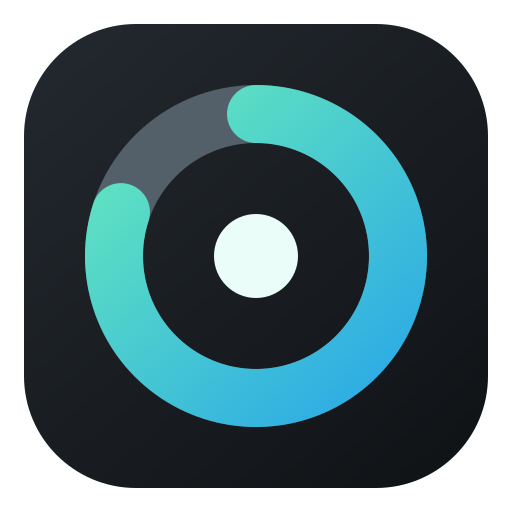
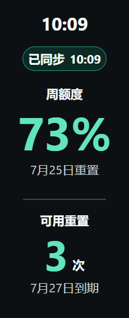
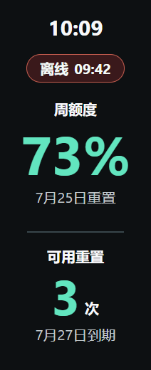
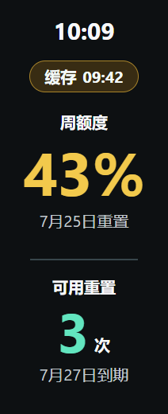

<p align="right"><a href="README_EN.md">English</a></p>

# 小米手环 10 Codex 额度

在小米手环 10 上随时查看 **Codex 周额度、下次重置日期和可用重置次数**。

<p align="center">
  
</p>

当前版本：**0.5.2（本地正式候选）**

> 前一轮 Windows、Android 与手环候选均已通过用户真机验收。当前代码与配置已统一为 0.5.2，并已生成本地正式候选产物；这不是 GitHub 已发布版本。当前日常链路为
> Windows 原生程序 → Android Codex额度 → 小米运动健康 → 小米手环 10。

[查看更新日志](CHANGELOG.md)

## 项目文档

- [项目上下文（产品范围与已确认决策）](CONTEXT.md)
- [Agent 工作规范](AGENTS.md)
- [当前状态与主任务交接](docs/current-status.md)
- [当前架构说明](docs/architecture.md)
- [开发、测试与交付指南](docs/development-guide.md)
- [构建验证记录](docs/build-verification.md)
- [真机验收记录](docs/device-acceptance.md)

## Android UI 当前状态（0.5.2 本地正式候选）

Android App 当前保留三页 Compose 结构：

- **首页**：同步胶囊、离线提示、红/黄/绿周额度圆环、电脑与手环合并状态胶囊、当前任务摘要、可用重置和图标底部导航。
- **任务页**：需要授权、处理中、等待查看分组；状态点与标题同列，底部状态和相对时间；隐藏/删除先二次确认，只影响本机与手环看板，新活动后可恢复。
- **设置页**：扫码连接电脑、检查手环连接、通知时机与手机/手环开关、Android 系统通知设置、隐藏任务标题和诊断导出。日常手环连接仍由小米运动健康维护。

额度状态以数据新鲜度为准：确认后 60 秒内显示“已同步”，超过 60 秒显示“缓存”，断开连接显示“离线”。客户端前台每 45 秒请求刷新、每 5 秒重评估；这不等同于 Android 进程被系统回收后仍能持续运行。

当前 APK 配置为 `com.codex.quota.android`，`0.5.2 / versionCode 502`；release APK 已完成本地构建、签名并已覆盖升级到验收手机。Windows 安装器与手环 release RPK 待正常升级确认。关键入口和完整构建命令见
[构建验证记录](docs/build-verification.md)与[架构说明](docs/architecture.md)。

## 手环页面预览

<table>
  <tr>
    <th align="center">已同步</th>
    <th align="center">离线</th>
    <th align="center">缓存</th>
  </tr>
  <tr>
    <td align="center"></td>
    <td align="center"></td>
    <td align="center"></td>
  </tr>
</table>

## 架构

0.5.2 的日常链路是：`Windows → Android Codex额度 → 小米运动健康 → 小米手环 10`。
AstroBox 只用于首次安装或升级手环 RPK，安装完成后可以退出，不参与日常额度同步和提醒。

0.3.1 仍是旧版 AstroBox 桥接架构，保留在历史版本中，不是当前 Android 架构的运行组件。

## 需要什么

- Windows 10/11 x64 电脑，并已登录和使用 ChatGPT 桌面端
- 小米手环 10
- Android 手机，已安装并连接手环的「小米运动健康」
- 手机与电脑连接同一个局域网

从源码构建 Android App 还需要从小米官方开发者渠道取得 `xms-wearable-lib_1.4_release.aar`，
放入 `android-app/app/libs/`；该第三方 SDK 不随本仓库分发。

### 手机兼容性

- **Windows → Android 手机看板**：原则上只要是 Android 8.0 及以上、能正常安装 APK 的手机即可；不要求小米手机。
- **手环同步**：必须在手机上安装并保持「小米运动健康」运行，并先在其中连接小米手环 10。非小米安卓手机可以尝试使用，但后台自启动、电池限制和系统权限可能影响持续同步。
- **AstroBox**：只用于首次安装或升级手环 RPK，不替代「小米运动健康」的日常连接；不安装「小米运动健康」时，手机看板仍可用，但手环同步不能保证。
- Xiaomi Smart Band 10 官方支持 Android 8.0 及以上；部分小米专属功能不属于本项目依赖范围。

0.5.2 只面向 Android。手环日常连接由小米运动健康保持，Android `Codex额度` 通过官方 Wearable SDK 转发额度摘要。

### 网络与代理

CodexQuota 不提供自己的代理设置，也不会要求输入代理地址、账号或密码。Windows 额度确认会自动沿用系统和常见
VPN/代理工具已设置的网络出口；支持标准 `ALL_PROXY`、`HTTPS_PROXY`、`HTTP_PROXY` 及小写变量，并尊重
`NO_PROXY`。未配置代理且可直连时会直接连接。代理仍由用户自行选择和维护；本项目不记录或同步代理地址、凭证或流量内容。

## 下载

正式版本从 [Releases](https://github.com/Vincent-hechuan/codex-quota-band/releases) 下载。下面是未来正式
`0.5.2` 正式组合将使用的文件名；当前本地候选的实际版本和验收状态以
[current-status.md](docs/current-status.md) 为准：

| 安装位置 | 文件 |
| --- | --- |
| Windows 电脑 | `Codex-Quota-Setup-0.5.2.exe` |
| Android 手机 | `CodexQuota-0.5.2.apk` |
| 小米手环 10（AstroBox 仅用于侧载） | `com.codex.quota.android.release.0.5.2.rpk` |

三个组件的版本号应当一致。

> 当前代码与配置基线是 `0.5.2 / versionCode 502`。Android release APK 已覆盖升级；Windows 与手环待正常升级验收。尚未提交、推送或发布。

## 安装

### 1. 安装 Windows 程序

1. 在本地正式候选构建完成后，双击 `Codex-Quota-Setup-0.5.2.exe`。
2. 安装完成后，程序会常驻 Windows 通知区域；如果没看到，请点击任务栏右下角的 `^`。
3. 当前测试版没有商业代码签名，Windows 可能提示“未知发布者”。请只从本仓库下载，并核对 Release 页面提供的 SHA-256。
4. 安装完成页默认勾选「完成后启动 Codex额度并显示配对二维码」。程序启动后会出现在 Windows 通知区域；右键图标可随时重新打开「显示配对二维码…」。
5. 安装器会自动写入或修复任务 Hook；若需要再次写入，可右键通知区域中的「Codex额度」，选择「安装/修复任务 Hook」。
6. 重启 ChatGPT 桌面端，在「ChatGPT → 设置 → 钩子 → 信任全部钩子」中确认 Hooks。安装器写入 Hook 不等于 ChatGPT 已完成信任；同时确认 `PreToolUse`、`PermissionRequest`、`UserPromptSubmit` 和 `Stop` 四项已开启。

Hook 首次安装或发生变更时需要在 ChatGPT 中确认启用一次。制作视频或图文教程时，应优先展示上述设置页路径；`/hooks` 命令只作为设置页不可用时的排障入口。

如果首页显示“任务状态不可用”但周额度正常，按以下顺序排查：

1. 在托盘选择「连接与诊断…」，确认 Windows 服务运行、Android 手机已连接；再查看额度源是否为「已确认」或「缓存」。
2. 选择「刷新当前状态」，等待一次确认完成；不要把手机仍在线误判为 ChatGPT 上游已更新。
3. 选择「安装/修复任务 Hook…」，然后在 ChatGPT「设置 → 钩子 → 信任全部钩子」中确认 Hooks。
4. 确认四类事件已开启，完全退出并重新打开 ChatGPT，再触发一条新任务。
5. 检查手机与电脑是否在同一可信局域网、是否启用了 VPN/代理、是否允许 Windows 通过专用网络防火墙；必要时让手机端绕过 VPN 访问电脑私网地址。

#### Windows 托盘与首次引导的实际行为

Windows 原生程序没有主窗口，常驻通知区域。右键托盘图标会显示当前服务、手机连接和额度上游摘要，并提供：

- 「刷新当前状态」：立即请求一次额度上游确认；
- 「显示配对二维码…」：打开二维码配对窗口；
- 「连接与诊断…」：查看 Windows 服务、Android 手机和额度源三项可验证状态；
- 「撤销手机配对」和「安装/修复任务 Hook…」；
- 默认勾选的「登录 Windows 时自动启动」以及「退出」。

二维码窗口只保留首次连接所需信息：手机端「Codex额度」App 扫码提示、App 内路径、
「确保手机和电脑在同一局域网·5分钟内有效」和「配对教学」按钮。配对教学会打开可拖动的步骤窗口，
右上角有产品风格关闭按钮，底部「我知道了」也可以关闭。二维码载荷一次性有效，过期后应从托盘重新生成。

安装器完成页默认勾选「完成后启动 Codex额度并打开新手引导」。已验证勾选后会启动已安装的托盘程序并打开二维码引导；
安装器还会在安装阶段写入/修复任务 Hook。已知限制是测试版没有商业代码签名，Windows 可能提示未知发布者；
如果已有同一托盘实例在运行，再次启动不会创建第二个实例，应从托盘菜单打开窗口。

### 2. 安装 Android 应用

1. 卸载旧 debug APK 后，在 Android 手机上安装本地 release APK `app-release.apk`。
2. 打开「小米运动健康」，确认手环保持连接。
3. 打开「Codex额度」，在设置页扫码连接电脑；手环日常连接与授权由小米运动健康保持。
4. 为保证锁屏期间实时同步，在系统允许时开启自启动、应用加锁和电池无限制。
5. 在「Codex额度 → 设置 → Android 系统通知设置」中确认「等待查看」和
   「需要授权」允许悬浮通知与锁屏通知。Android 会保留这些系统权限供用户决定，
   应用不能强制开启。

### 3. 一次性安装手环 RPK

1. 临时打开 [AstroBox](https://astrobox.online/downloads/)，进入已连接的小米手环 10 设备页面。
2. 找到「快应用数量」卡片。
3. 点击卡片右上角的齿轮图标。
4. 点击右上角的 `+`，导入本地 RPK 文件。
5. 选择本地正式候选 `com.codex.quota.android.release.0.5.2.rpk`。
6. 等待安装完成，手环应用列表中会出现「Codex 额度」。
7. 回到手机 App 的「设置」，点击「检查手环连接」，按小米系统提示授予权限（如出现）。
7. 退出 AstroBox，重新确认小米运动健康仍显示手环已连接。

## 首次配对

1. 确保手机和电脑连接同一个可信局域网；两端都能上网不代表位于同一局域网。
2. 右键 Windows 通知区域中的 Codex额度图标，选择「显示配对二维码…」。
3. 在 Android 手机上的「Codex额度」App 中打开「设置 → 扫码连接电脑」，扫描电脑上的二维码。
4. 按 App 提示完成配对；不需要手动输入电脑地址或临时代码。
5. 打开手环上的「Codex 额度」，数据通常会在数秒内出现。

二维码内的一次性配对材料只在短时间内有效。正常使用不需要输入电脑地址或临时代码；扫码失败时，重新生成二维码并确认手机和电脑位于同一局域网。

## 常见问题

### 扫码后没有打开「Codex额度」

确认 Android 已安装同一版本的候选 APK，并用系统相机重新扫描 Windows 配对窗口二维码。当前 Android 架构不使用 AstroBox 插件接收配对。

### Android 找不到 Windows

- 确认手机和电脑位于同一局域网；两端都能上网不代表在同一局域网，网段不同、访客 Wi-Fi 或客户端隔离都会导致电脑离线。
- 如果开启了 VPN/代理，让 Android 应用和电脑私网地址绕过 VPN。
- 首次启动 Windows 程序时，允许它通过 Windows 防火墙的专用网络。
- 不要在公司访客 Wi-Fi、公共 Wi-Fi 或开启了客户端隔离的网络中配对。

### Windows 安装器提示无法写入 `CodexQuota.exe`

请使用最新安装器重试。安装器会先请求关闭旧版 Codex额度托盘进程，再覆盖安装；它不会关闭其他程序。若仍被 Windows 占用，先从托盘菜单退出 Codex额度后再重试。

### 手环显示离线或数据不更新

- 确认「小米运动健康」仍在后台连接手环；Android App 会显示当前手环连接状态。
- 确认手环安装的是与 Android 同一候选版本的 `com.codex.quota.android` RPK，不要继续打开旧的 `com.codex.quota` RPK。

### 重装 Codex 后只有周额度，重置次数显示 `--`

周额度和可用重置次数来自 Codex 的不同本地数据。重装 Codex 后，周额度通常仍可读取，但包含重置次数的网络缓存可能已经被清空。

1. 打开 ChatGPT 客户端的「使用量」页面。
2. 展开「使用限额重置」，等待重置卡片完整显示。
3. 右键 Windows 通知区域中的 Codex Quota 图标，点击「立即刷新」。
4. 等待约 5～10 秒，再重新打开手环应用。

当前 Android 架构在新缓存尚未生成时会保留上一份仍未到期的重置数据，并以「缓存」提示当前状态；ChatGPT 重新生成缓存后会自动恢复为「已同步」。

### AstroBox 与小米运动健康

AstroBox 只在安装或升级 RPK 时临时使用。日常请让小米运动健康保持手环连接，AstroBox 可以退出；这样不会再由 AstroBox 抢占手环主连接。

## 隐私说明

- 手机和手环数据只在你的 Windows、手机和手环之间传输，不经过本项目的云服务器。为确认额度，Windows 会直接连接官方 ChatGPT/Codex 额度接口，不经本项目中转。
- 只读取和显示额度摘要，不读取或发送对话、提示词、项目文件和终端内容。
- 不读取 ChatGPT/Codex Cookie 或登录密码。Windows 会在本机读取现有 Codex 访问令牌，仅用于向官方额度接口确认额度；令牌只驻留 Windows 进程内存，不写入日志、缓存、诊断，不传给手机或手环。
- Windows 托盘菜单可以随时撤销所有已配对设备。
- 只建议在手机和电脑的同一个局域网中使用，不要把 Windows 服务端口暴露到公网。

## 卸载

- Windows：在「设置 → 应用 → 已安装的应用」中卸载 Codex Quota。
- 手机：卸载「Codex额度」APK；如不再使用手环 RPK，再通过 AstroBox 移除「Codex 额度」应用。
- 手环：在 AstroBox 中卸载「Codex 额度」应用。

<details>
<summary>开发者构建与测试</summary>

要求 Node.js 24+、PowerShell、Rust/WASI 环境和小米 Vela 快应用工具链。

```powershell
npm install
npm test
npm run test:plugin
npm run build:plugin

Set-Location windows-native
.\scripts\build-installer.ps1
.\scripts\test-installer.ps1

Set-Location android-app
..\spikes\android-background-probe\gradlew.bat -p . :app:testDebugUnitTest :app:assembleDebug

Set-Location band-app
npm install
npm run build
```

安全模型见 [docs/security.md](docs/security.md)；当前代码分层见
[docs/architecture.md](docs/architecture.md)。

</details>

## 说明

这是社区制作的开源项目，不是 OpenAI、小米或 AstroBox 的官方产品。

使用 [MIT License](LICENSE)。
