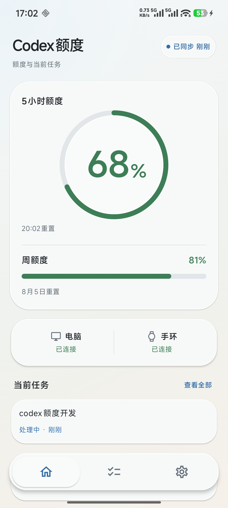
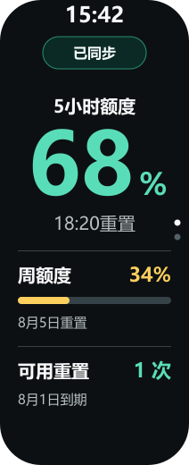

<a href="README_EN.md">English</a>

# 小米手环 10 Codex 额度

在电脑、安卓手机和小米手环 10 上查看 **Codex 5 小时额度、周额度、重置时间和当前任务状态**。

  

  <strong>当前版本：0.6.0</strong>

## 它能做什么

- 在手机和手环上查看 Codex 5 小时额度、周额度和重置时间。
- 查看 ChatGPT Windows 客户端中的任务状态：
  `处理中`、`需要授权`、`等待查看`。
- 在任务需要授权或等待查看时向手机、手环发送提醒。
- 数据只在你的电脑、手机和手环之间传输，不经过本项目的云服务器。

<table>
  <tr>
    <th align="center">手机首页</th>
    <th align="center">手环首页</th>
  </tr>
  <tr>
    <td align="center"></td>
    <td align="center"></td>
  </tr>
</table>

## 使用前准备

你需要：

- 一台 Windows 10 或 Windows 11 电脑；
- 已登录并正常使用的 ChatGPT Windows 客户端；
- 一台安卓 8.0 或更高版本的手机；
- 小米手环 10；
- 其他版本的小米手环暂未完成真机验证，可能出现页面错位或显示异常，请等待后续版本更新；
- 手机中已安装「小米运动健康」，并已连接手环；
- 手机和电脑连接同一个局域网。

## 下载

正式版本发布后，请从 [GitHub Releases](https://github.com/Vincent-hechuan/codex-quota-band/releases) 下载同一版本的三个文件：

| 安装位置 | 文件 |
| --- | --- |
| Windows 电脑 | `Codex-Quota-Setup-0.6.0.exe` |
| 安卓手机 | `CodexQuota-0.6.0.apk` |
| 小米手环 10 | `com.codex.quota.android.release.0.6.0.rpk` |

三个文件的版本号必须一致。不要从不明网站下载安装包。

## 安装和连接

### 第一步：安装 Windows 程序

1. 双击 `Codex-Quota-Setup-0.6.0.exe`。
2. 安装完成后，Codex额度会出现在任务栏右下角的通知区域；如果没有看到，请点击 `^`。
3. 安装完成页会默认启动程序并显示配对二维码。
4. 重启 ChatGPT，在「ChatGPT → 设置 → 钩子 → 信任全部钩子」中确认以下四项已开启：
   `PreToolUse`、`PermissionRequest`、`UserPromptSubmit`、`Stop`。

### 第二步：安装安卓应用

1. 在手机上安装 `CodexQuota-0.6.0.apk`。
2. 打开「小米运动健康」，确认手环仍然在线。
3. 打开手机上的「Codex额度」。
4. 建议在手机系统中为 Codex额度开启：
   - 自启动；
   - 应用加锁；
   - 电池使用不受限制。

这些设置能提高锁屏和后台同步的稳定性，但安卓系统仍可能在内存不足时结束应用。

### 第三步：连接手机和电脑

1. 确认手机和电脑连接同一个局域网。
2. 右键 Windows 通知区域中的「Codex额度」，选择「显示配对二维码…」。
3. 在手机「Codex额度 → 设置」中点击「扫码连接电脑」。
4. 扫描电脑上的二维码并按提示完成配对。
5. 配对成功后，手机首页会显示电脑“已连接”，额度和任务会自动同步。

二维码只在短时间内有效。过期后，从 Windows 通知区域重新生成即可，不需要手动输入电脑地址或配对码。

### 第四步：安装手环应用

AstroBox 只在安装或升级手环应用时临时使用，不参与日常同步。

1. 临时打开 [AstroBox](https://astrobox.online/downloads/)。
2. 进入已连接的小米手环 10 设备页面。
3. 打开「快应用数量」右上角的设置。
4. 点击 `+`，导入 `com.codex.quota.android.release.0.6.0.rpk`。
5. 等待安装动画结束。
6. 安装完成后退出 AstroBox，重新确认「小米运动健康」仍显示手环已连接。
7. 在手机「Codex额度 → 设置」中点击「检查手环连接」，按系统提示授权。
8. 打开手环上的「Codex额度」，数据通常会在几秒内出现。

## 日常使用

平时只需要保持以下程序正常运行：

- Windows 通知区域中的 Codex额度；
- 安卓手机上的 Codex额度；
- 小米运动健康。

AstroBox 可以退出。

状态含义：

| 状态 | 含义 |
| --- | --- |
| 已同步 | 最近一次额度确认仍然有效 |
| 缓存 | 显示的是上一次可信数据，不是实时数据 |
| 离线 | 手机无法连接电脑或手环 |
| 处理中 | ChatGPT 正在处理任务 |
| 需要授权 | ChatGPT 正在等待你确认操作 |
| 等待查看 | 当前一轮已经停下，等待你查看结果；不代表成功或失败 |

如果上游暂时没有提供 5 小时额度，手机和手环会显示 `-- / 暂无数据`，不会猜测额度。

## 检查更新

手机「Codex额度 → 设置 → 检查更新」会检查本项目公开的 GitHub Release：

- 已是最新版时会显示提示；
- 有新版本时会先显示版本和更新说明；
- 只有你点击“前往下载”后才会打开 GitHub；
- 不会自动下载或安装。

## 常见问题

### 手机扫码后连不上电脑

- 确认手机和电脑在同一个局域网；两端都能上网不代表在同一个局域网。
- 不要使用访客 Wi-Fi、公共 Wi-Fi 或启用了设备隔离的网络。
- 首次启动时，允许 Codex额度通过 Windows 防火墙的专用网络。
- 如果启用了 VPN 或代理，让手机访问电脑私网地址时绕过 VPN。
- 在 Windows 通知区域打开「连接与诊断…」查看具体状态。

### 手机锁屏后显示缓存

在手机系统中为 Codex额度开启自启动、应用加锁和电池使用不受限制。不同品牌手机的设置名称可能略有不同。

### 手环显示离线或不更新

1. 确认「小米运动健康」仍显示手环已连接。
2. 完全退出 AstroBox，避免它继续占用手环连接。
3. 确认手机、手环安装的是同一版本。
4. 在手机 Codex额度的设置中点击「检查手环连接」。

### 任务状态不可用

1. 在 Windows 通知区域选择「安装/修复任务 Hook」。
2. 重启 ChatGPT。
3. 打开「ChatGPT → 设置 → 钩子 → 信任全部钩子」。
4. 确认四项 Hook 均已开启，然后新建一个任务测试。

### 5 小时额度显示 `--`

这表示当前上游数据中还没有 5 小时额度，不是同步失败。周额度、任务和手环连接仍可正常使用；上游提供数据后会自动显示。

### 重装后可用重置次数显示 `--`

打开 ChatGPT 的使用量页面，展开额度重置相关内容并等待加载完成，然后在 Windows 通知区域选择「刷新当前状态」。

## 隐私说明

- 不读取或传输你的提示词、回复、命令、文件路径、终端输出或完整日志。
- 不读取 ChatGPT Cookie 或登录密码。
- Windows 只在本机使用现有 Codex 访问令牌查询官方额度；令牌不会写入项目日志、诊断、手机或手环。
- 手机与电脑通过加密连接在局域网中同步。
- 不包含广告、遥测或自动崩溃上报。
- 请勿把 Windows 同步端口暴露到公网。

更多说明见 [安全说明](docs/security.md)。

## 卸载

- Windows：在「设置 → 应用 → 已安装的应用」中卸载 Codex额度。
- 安卓手机：直接卸载 Codex额度。
- 小米手环：通过 AstroBox 卸载 Codex额度。

## 开源与开发

这是社区制作的开源项目，不是 OpenAI、小米或 AstroBox 的官方产品。

源码使用 [MIT License](LICENSE)。开发者可阅读：

- [架构说明](docs/architecture.md)
- [开发指南](docs/development-guide.md)
- [安全说明](docs/security.md)
- [贡献指南](CONTRIBUTING.md)

从源码构建安卓应用需要自行从小米官方开发者渠道取得 Wearable SDK。该第三方二进制不随仓库分发。
