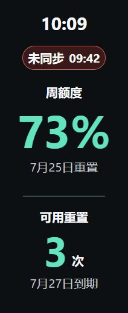

<p align="right"><a href="README.md">简体中文</a></p>

# Codex Quota for Xiaomi Smart Band 10

View your **Codex weekly quota, next reset date, and available reset credits** on Xiaomi Smart Band 10.

<p align="center">
  
</p>

Current version: **0.3.0**

## Band screen previews

<table>
  <tr>
    <th align="center">Synced</th>
    <th align="center">Not synced</th>
    <th align="center">Cached</th>
  </tr>
  <tr>
    <td align="center"></td>
    <td align="center"></td>
    <td align="center"></td>
  </tr>
</table>

## Before you start

Install [AstroBox](https://astrobox.online/downloads/) on an Android phone and connect Xiaomi Smart Band 10 in AstroBox first. AstroBox installation, permissions, and initial band pairing are outside this project's setup flow; consult an online AstroBox tutorial if you have not completed them yet.

## Requirements

- A Windows 10/11 x64 computer with Codex installed and in use
- Xiaomi Smart Band 10
- An Android phone that can run AstroBox and connect to the band
- The phone and computer connected to the same trusted local network

In principle, any Android phone that can keep AstroBox running and connected to Xiaomi Smart Band 10 should work. Background-process and VPN settings may vary by phone brand and system version. iPhone is not currently supported.

## Download

Download all three files from the same version on the [Releases](https://github.com/Vincent-hechuan/codex-quota-band/releases) page:

| Install on | File |
| --- | --- |
| Windows computer | `Codex-Quota-Setup-0.3.0.exe` |
| Android / AstroBox | `codex-quota-astrobox-0.3.0.abp` |
| Xiaomi Smart Band 10 | `com.codex.quota.debug.0.3.0.rpk` |

All three components should have the same version number. The Releases page may remain empty until the first public test package is published.

## Installation

### 1. Install the Windows app

1. Run `Codex-Quota-Setup-0.3.0.exe`.
2. After installation, the app stays in the Windows notification area. If it is hidden, click the `^` icon in the taskbar.
3. The current test build is not commercially code-signed, so Windows may display an “Unknown publisher” warning. Download only from this repository and verify the SHA-256 value shown on the Release page.

### 2. Install the AstroBox plugin

1. Open AstroBox on the Android phone.
2. Tap 「插件」 (Plugins) in the bottom navigation bar.
3. Tap the `+` button in the upper-right corner and import a local plugin.
4. Select `codex-quota-astrobox-0.3.0.abp`.
5. Restart AstroBox after the import finishes.
6. Open 「插件」 again. 「Codex 额度桥接」 should now appear in the installed plugin list.
7. Open 「Codex 额度桥接」 once so that its QR-code entry point is registered.

### 3. Install the band app

1. Open AstroBox and enter the page for the connected Xiaomi Smart Band 10.
2. Find the 「快应用数量」 (Quick app count) card.
3. Tap the gear icon in the upper-right corner of the card.
4. Tap the `+` button in the upper-right corner and import a local RPK file.
5. Select `com.codex.quota.debug.0.3.0.rpk`.
6. Wait for installation to finish. 「Codex 额度」 will appear in the app list on the band.

## First pairing

1. Make sure the phone and computer are on the same Wi-Fi or trusted local network.
2. Right-click the Codex Quota icon in the Windows notification area and select 「显示配对信息…」 (Show pairing information).
3. Scan the QR code on the computer with the Android system camera.
4. Choose to open the link in AstroBox and wait for the plugin to report a successful pairing.
5. Open 「Codex 额度」 on the band. Quota data should appear within a few seconds.

The QR code and six-digit pairing code expire quickly. You normally do not need to type the computer address. Use the advanced manual information in the Windows pairing window only if QR pairing fails.

## Troubleshooting

### Scanning opens only the AstroBox plugin list

Open 「Codex 额度桥接」 manually once, go back, and scan again. If it still fails, re-import the ABP package.

### The plugin cannot find Windows

- Confirm that the phone and computer are on the same local network.
- If a VPN or proxy is enabled, allow AstroBox and local-network addresses to bypass it.
- When the Windows app starts for the first time, allow it through Windows Firewall on private networks.
- Avoid guest Wi-Fi, public Wi-Fi, and networks with client isolation enabled.

### The band shows offline or stops updating

- Confirm that AstroBox is still running in the background and connected to the band.
- Disable battery restrictions for AstroBox and grant background, Bluetooth, and nearby-device permissions.
- If AstroBox, the phone, or the plugin has restarted, generate a new QR code from Windows and pair again.

### Xiaomi Fitness competes for the connection

If AstroBox disconnects repeatedly, temporarily stop Xiaomi Fitness while installing and pairing. Afterwards, adjust the phone's background settings so both apps can coexist.

## Privacy

- Data moves only between your Windows computer, Android phone, and band. This project does not use a cloud relay server.
- It reads and displays only quota summaries. It does not read or transmit conversations, prompts, project files, or terminal content.
- It does not read ChatGPT/Codex cookies, passwords, or access tokens.
- You can revoke all paired devices from the Windows tray menu at any time.
- Use it only on a trusted local network. Do not expose the Windows service port to the public internet.

## Uninstall

- Windows: uninstall Codex Quota from Settings → Apps → Installed apps.
- Android: remove 「Codex 额度桥接」 from AstroBox.
- Band: uninstall 「Codex 额度」 through AstroBox.

<details>
<summary>Developer build and test instructions</summary>

Requires Node.js 24+, PowerShell, a Rust/WASI environment, and the Xiaomi Vela quick-app toolchain.

```powershell
npm install
npm test
npm run test:plugin
npm run build:win
npm run build:plugin

Set-Location band-app
npm install
npm run build
```

See [docs/security.md](docs/security.md) for the security model.

</details>

## Notice

This is a community open-source project, not an official product of OpenAI, Xiaomi, or AstroBox.

Licensed under the [MIT License](LICENSE).
