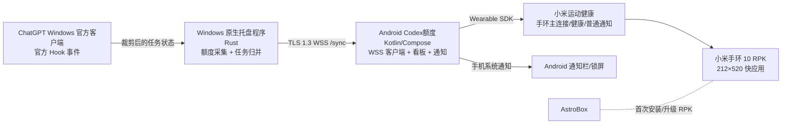

# CodexQuota 0.5.2 架构说明

本文是给开发者和未来 Agent 的实现说明。产品取舍和“不做什么”以根目录
`CONTEXT.md` 为准；这里记录当前代码应当如何协作。

## 1. 系统目标

CodexQuota 让用户在不抢占小米运动健康主连接的前提下，在手机和小米手环上查看：

- Codex 周额度、下次重置日期和可用重置次数；
- 官方 ChatGPT Windows 客户端任务的只读状态；
- “等待查看”和“需要授权”的手机/手环提醒。

当前产品是 Android-only 的本地工具，不是 ChatGPT 客户端替代品，也不提供反向控制、回复消息或远程操作电脑。

## 1.1 当前候选状态（2026-07-29）

三端当前验收状态、临时版本差异和未决产品冲突以 [current-status.md](current-status.md) 为准。本节只记录
当前代码和协议事实，不能据此覆盖 `CONTEXT.md` 中已经确认的产品交互。

- 当前代码与配置基线：`0.5.2 / versionCode 502`，Windows、Android APK 和手环 RPK 按同一产品版本管理；已完成本地构建，尚未发布。
  已验收的前一轮候选为 Windows/Android `0.4.0` 与手环 `0.4.9 / versionCode 50`；它们只保留为验证证据，不构成可发布的统一套件。
- 自动化验证：手环 `npm run build` 后页面测试 22/22；Windows、Android 和根目录的其他验证结果以各自
  最新章节为准。本候选没有重新构建 Android、Windows 或协议。
- 前一轮已完成的真机链路：二维码配对、额度同步、任务标题与状态、任务本机移除、失焦/锁屏通知、手环提醒，
  以及 Windows 安装器启动和覆盖安装流程；Android 手机 App 的首页、任务页和设置页已通过用户最终验收。
- Android UI 验收结果：保留红/黄/绿周额度圆环，电脑与手环合并为统一胶囊，移除无法可靠监控的 ChatGPT
  状态卡；离线/缓存使用灰阶圆环和顶部缓存状态，设置页保留扫码连接电脑、隐藏任务标题和导出诊断入口。
- Android quota v3 已接入：Client Hello 声明 `[1,2,3]`，按 Server Hello 保存并严格校验 quota
  version；v2/v3 重置卡只保留状态、`grantedAt`、`expiresAt`。v3 额外使用脱敏的
  `upstreamFreshness` 区分上游已确认、缓存和待确认，v1/v2 回退保持兼容。
- 已确认的使用前提：手机和电脑必须在同一可信局域网；ChatGPT 中需要在「设置 → 钩子 → 信任全部钩子」中确认
  Hooks；AstroBox 只用于侧载或升级 RPK。
- Windows 原生候选的可见界面保持托盘优先：配对窗口只负责扫码引导，连接与诊断只展示可验证的服务、手机
  和同步状态，不推断 Hook 信任；撤销手机配对会主动关闭现有同步连接，使手机无需重启即可进入离线状态。
- 重置卡的准确发卡/到期时间由 Windows 单点读取本机 `.codex/auth.json` 后直接查询；访问令牌仅驻留在
  Windows 进程内存。Windows 只本地缓存并向下游白名单化传递可用数量、`grantedAt`、`expiresAt`，不传令牌、
  Cookie、卡片唯一 ID、标题、描述或原始响应。
- 配对后的额度协议保持协商式兼容：客户端声明 v1 时继续收到 v1，声明 v2 时收到无卡片身份字段的
  重置卡时间摘要，只有声明 v3 才收到上游新鲜度。任何快照都必须与当前连接的 Server Hello 匹配。
- 验收与发布状态：用户已确认 Windows、Android 和手环当前候选均验收通过；尚未提交、推送或创建
  GitHub Release。正式发布前仍需处理三端产品版本统一，且发布操作必须由用户另行要求。

## 2. 运行链路

AstroBox 不在当前 Android 架构的日常数据和提醒链路中。安装或升级 RPK 后可以退出，日常连接继续交给小米运动健康。

## 2.1 Windows UI 与新手流程（当前候选）

Windows 原生端采用托盘优先的单实例行为，没有常驻主窗口。托盘菜单实际提供：

- 「刷新当前状态」；
- 「显示配对二维码…」；
- 「连接与诊断…」；
- 「撤销手机配对」；
- 「安装/修复任务 Hook…」；
- 默认开启且带勾选状态的「登录 Windows 时自动启动」；
- 「退出」。

「显示配对二维码…」打开 460×560 的原生窗口，主页面只展示二维码、手机端
「Codex额度」App 的扫码路径、同一可信局域网要求和 5 分钟有效期。底部「配对教学」打开可拖动的
轻量教学窗，教学窗有自绘关闭按钮和「我知道了」按钮。配对窗口和教学窗均在工作区内定位，不使用系统默认左上角坐标。

「连接与诊断…」打开 480×340 的状态窗，显示 Windows 服务、Android 手机和 Codex 额度源；
「立即确认」只触发额度上游确认，不把手机在线或任务收包当成额度实时确认。撤销配对会主动关闭已认证同步会话，
手机随后进入离线状态。

安装器完成页默认勾选「完成后启动 Codex额度并打开新手引导」。安装阶段先关闭旧的 CodexQuota.exe、
写入/修复任务 Hook，再由完成页启动已安装程序并打开二维码引导。Hook 写入完成后，用户仍必须在 ChatGPT
「设置 → 钩子 → 信任全部钩子」中确认 Hooks；
这一步不会由 Windows 客户端代替。

## 2.2 已统一的三端文案与视觉决策

以下是当前候选已落实的统一项；后续改动必须继续保持这些语义：

- Hook 路径和信任动作：统一采用「ChatGPT → 设置 → 钩子 → 信任全部钩子」；
- 上游新鲜度短标签：Android、Windows 诊断与手环统一使用「已同步 / 缓存 / 待同步 / 离线」；
  内部 `current / cached / unavailable` 协议状态不直接进入普通用户界面；
- 配对引导：Windows 与 Android 统一采用「手机端『Codex额度』App」和「打开 App → 设置 → 扫码连接电脑」；
- 圆角和材质：Windows 保持原生轻量窗口与 32px 表面圆角，Android/手环继续按各自平台限制转译，
  不把 Windows 标题栏或桌面按钮机械复制到手机和手环。

## 3. 三个运行组件

### Windows 原生端

位置：`windows-native/`

- `src/bin/codex_quota_windows.rs`：托盘程序、开机启动、二维码配对窗口、服务生命周期。
- `src/hook.rs`：读取 Hook 标准输入、限制输入大小、把事件写入本地 spool，并使用
  `session_index.jsonl` 的 `thread_name` 解析任务标题。原始 prompt 不写入任务同步结果。
- `src/quota.rs`：从 ChatGPT/Codex 本地 Chromium 缓存中提取白名单额度摘要，并保留可信缓存。
- `src/host.rs`、`src/network.rs`：配对、TLS 身份、WSS `/pair` 和 `/sync`、心跳和连接管理。
- `src/storage.rs`：Windows DPAPI 保护的身份和配对数据。
- `src/foreground.rs`：只依据官方 ChatGPT Windows 应用身份判断是否失焦，不读取窗口标题或会话内容。

Windows 只发布额度白名单和 Task Sync v1 摘要，不转发命令、工具参数、文件路径、回复或完整日志。

### Android 手机端

位置：`android-app/`

#### 当前 UI 布局与交互（0.5.2）

- **首页**：顶部显示“Codex 额度 / 额度与当前任务”和同步胶囊；离线时先显示离线提示。主体依次为周额度圆环、电脑与手环合并状态胶囊、当前任务摘要和可用重置。圆环使用既有红/黄/绿额度语义；正常新鲜快照显示百分比，缓存/离线显示灰阶，圆环中心不再放置重复说明文字。底部为仅图标的首页、任务、设置导航。
- **任务页**：按“需要授权 / 处理中 / 等待查看”分组，卡片保持高信息密度。每行左侧彩点表示状态，标题与操作位于同一行，底部显示状态和相对时间；需要授权使用红色状态文字，其他状态默认灰色。页面提示明确说明隐藏只影响手机和手环看板。
- **设置页**：保留“连接与设备、提醒、显示与数据”分组。连接入口是扫码连接电脑；提醒包含通知时机、需要授权/等待查看、手机通知和手环提醒开关，并提供 Android 系统通知设置入口；显示与数据包含本机隐藏任务标题和诊断日志导出。当前没有单独的 Windows/手环设备卡片。
- **同步与状态**：WSS 在线本身不等于额度刚刚确认。新鲜度在 60 秒内显示“已同步”，超过 60 秒转为“缓存”，离线显示“离线”；客户端每 45 秒请求一次刷新，并每 5 秒重新评估年龄。该刷新依赖进程存活，不承诺被 Android 杀死后仍持续执行。

#### 任务移除语义

任务页的“隐藏/删除”操作都先弹出二次确认。确认后只在 Android 本机按会话 ID 隐藏任务，同时从手机与手环摘要中移除；不会删除 ChatGPT 对话或修改 Windows Hook 数据。该会话出现新的活动快照后，任务允许重新出现在看板中。

#### 配对、手环与通知行为

- **二维码配对**：设置页调用系统相机拍摄 Windows 托盘二维码，不内置扫码 SDK，也不申请相机权限；读取配对链接后校验有效期、TLS 身份和局域网端点，成功后保存本机配对凭据并启动 WSS 同步。二维码过期或不在同一局域网时配对失败。
- **手环连接检查**：应用启动时初始化 `XiaomiWearableBridge`；显式检查会刷新 Wearable 状态、请求所需权限并再次刷新。日常手环连接由小米运动健康维护，Android 不接管主连接；设置页当前不展示独立设备检查卡片。
- **通知**：通知时机可选“从不 / 失焦 / 始终”，需要授权和等待查看分别控制，手机与手环开关独立。处理中默认静默；手机通知还受 Android 13+ `POST_NOTIFICATIONS` 系统权限约束，应用只发起一次请求并提供系统通知设置入口，不能强制开启。没有前台服务，系统杀死进程后不保证通知必达。

- `CodexQuotaApplication`：创建通知渠道、运行时仓库、WSS 客户端和小米桥接。
- `runtime/PairingClient`：处理 `codexquota://pair` 深链和一次性配对。
- `runtime/SyncWebSocketClient` / `SyncStreamSession`：固定电脑公钥、连接 `/sync`、重连、序列号和快照去重；
  连接存活时每 45 秒发送一次已认证的额度刷新请求，并每 5 秒复核上游确认的年龄。
- `runtime/RuntimeStateRepository`：保存最近可信额度、重置数据、任务快照、连接状态和本机隐藏任务。
- `notifications/TaskAlertCoordinator`：把任务状态变化、ChatGPT 失焦、Android 前台状态、重连和六项通知设置合并成投递决策。
- `notifications/TaskNotificationDispatcher`：发 Android 系统通知。
- `runtime/XiaomiWearableBridge`：通过官方 `xms-wearable-lib_1.4_release.aar` 与匹配签名的 RPK 通信。
- `ui/`：首页、任务、设置三页 Compose 看板。任务移除只影响本机和手环摘要，确认后才隐藏。

Android 端不使用 WebView、Flutter 或 React Native，不使用常驻前台服务。用户可在系统设置中开启自启动、应用加锁和电池无限制，以提高后台存活概率。

### 小米手环端

位置：`band-app/`

- `src/pages/index/index.ux`：手环页面布局和触控/滚动。
- `src/common/quota-state.cjs`：额度状态和颜色语义。
- `src/common/task-state.cjs`：任务状态排序和摘要。
- `src/manifest.json`：包名、版本和签名关联。

当前页面结构（小米手环 10，`212×520`、DPR 2.0）：

- 根节点是一个 `div`，内部使用 Vela 原生纵向 `swiper`，`loop=false`、`enableswipe=true`，包含两张同高页面；
  这是上下滑动切页，不是横向分页，也不是自由长列表。没有自定义 touchend、强制 index 或动画时长，翻页惯性和
  系统边缘侧滑返回交给 Vela/系统处理。
- 两页都在顶部弧形安全区外沿显示系统时间；同步胶囊位于时间下方。第一页依次为“周额度”、额度百分比、周重置日、
  分割线、“可用重置”、可用次数和最近到期日；第二页只保留任务摘要，不再增加“任务”标题。
- 页面右侧使用 Vela 原生两个小圆点作为页指示器；任务时间区域主动左收，避免与页指示器重叠。页面不使用圆环、
  卡片、模糊、复杂阴影或横向滚动。
- 当前 UI 候选的主要几何：同步胶囊 `left=48px,width=116px,height=36px`；额度区 `top=110px`，主数字
  `96px`（三位数紧凑档 `80px`），分割线 `top=280px`，重置区 `top=306px`；任务区 `top=115px`，每项
  `86px`，状态点 `7px`，状态/时间行宽 `140px`。

任务和额度语义：

- 任务最多展示 3 条，输入标题最多 16 个 Unicode 字符，标题最多两行并省略；排序固定为“需要授权 → 处理中 →
  等待查看”。状态点分别为红 `#ff7e7e`、蓝 `#59aaf2`、绿 `#67ce91`，文字仍明确写出状态，不依赖颜色单独传达。
- 周额度使用红/黄/绿额度语义；可用重置紧接在周额度下方，次数与单位保持同一视觉组，最近到期只显示月日。
- 同步新鲜度：新快照在 60 秒内显示“已同步”，不附具体时间；超过 60 秒显示“缓存 + 相对分钟”。离线、暂停、
  上游缓存或数据异常仍使用各自状态，不将任务活动或局域网在线冒充额度实时性。
- 手环只接收 Android 裁剪后的额度和任务摘要；不接收令牌、Cookie、卡片 ID、标题描述、原始响应、提示词或日志。
  手环通知亮屏/震动仍由 Android Wearable Bridge、小米运动健康与系统设置共同决定。

## 4. 协议与信任边界

协议契约位于 `contract/`：

- `pairing-offer-v1.schema.json`：二维码中的一次性配对载荷和电脑公钥指纹。
- `pairing-session-v1.schema.json`：配对请求/响应。
- `sync-stream-v1.schema.json`：WSS 会话、心跳、快照和序列号。
- `snapshot-v1.schema.json` / `snapshot-v2.schema.json` / `snapshot-v3.schema.json`：Windows → Android
  的额度快照版本契约；v3 新鲜度不包含凭证、原始响应或错误详情。
- `wearable-quota-v2.schema.json`：Android → 手环的独立脱敏额度摘要；重置卡不含 `id/title/description`。
- `task-sync-v1.schema.json`：任务状态、短标题、会话标识和生成时间。

配对和同步规则：

1. 二维码不携带长期手机令牌，只携带短时一次性码、候选私网地址和电脑公钥指纹。
2. 日常同步使用 TLS 1.3 WebSocket；Android 通过公钥固定验证已配对电脑，不能因为 IP 变化或普通自签名证书就信任新主机。
3. Android 和 Windows 都拒绝未知字段、非法时间、跨连接倒序序列和过大的输入。
4. 配对凭据存储在 Android Keystore 加密区域；Windows 私钥使用 DPAPI 保护。撤销配对后旧凭据立即失效。
5. 默认网络边界是可信局域网，不提供公网中继和后台遥测。
6. Android 下拉刷新通过当前已认证 WSS 发送 `refresh_request(scope=quota)`；请求必须匹配当前
   connection ID。Windows 使用 10 秒全局冷却后查询上游，返回的新鲜度仍不包含错误详情或凭证。

更细的安全理由见 `docs/security.md` 和 `docs/adr-003-encrypted-lan-pairing.md`、`docs/adr-004-tls-sync-stream.md`。

## 5. 任务状态和通知语义

### 状态来源

| Hook 事件 | 手机/手环显示 | 默认行为 |
| --- | --- | --- |
| `UserPromptSubmit`、`PreToolUse` | `处理中` | 只更新面板，不提醒 |
| `PermissionRequest` | `需要授权` | 按通知时机、类型和渠道开关提醒 |
| `Stop` | `等待查看` | 按通知时机、类型和渠道开关提醒 |

`等待查看` 只表示本轮 Hook 已停止，不推断“已完成”；当前 Hook 也不声明普通等待输入或受阻状态。

### 通知决策顺序

`TaskAlertCoordinator` 对每个会话只处理状态变化：

1. 相同状态重复事件去重；
2. 冷启动不回放历史等待查看；重连时只对仍存在的需要授权任务按规则提醒；
3. ChatGPT 前台或 Android 看板前台时，更新状态但抑制提醒；失焦、最小化或锁屏后才按设置判断；
4. 手机通知和手环通知独立开关；关闭渠道不会停止数据同步；
5. Android 系统通知权限、悬浮通知和锁屏显示最终由系统和用户决定，应用不能强制开启。

默认设置是“仅在 ChatGPT 失焦时”，等待查看和需要授权均开启，手机和手环渠道均开启。处理中永远不提醒。

## 6. 数据生命周期

- Windows 保留额度和任务的最小本地摘要，以支持重连和可信缓存。
- Android 运行时仓库保留最近可信额度、重置数据和最新任务板；WSS 最近收包时间只用于传输刷新，
  不作为额度新鲜度。v3 的额度显示只依据上游 `lastSuccessAt` 和状态；Android 会每 5 秒复核，
  上游成功确认超过 60 秒即使服务仍连通也显示“缓存”。断线显示“离线”，上游失败显示
  “缓存”或“待确认”，不把局域网在线、任务更新或进程存活伪装成实时额度。
- 任务移除记录存储在 Android 本地，按会话 ID 和状态/更新时间隐藏；同一任务有新活动时自动恢复。
- 手环只收到当前过滤后的额度和最多 3 条任务摘要，不接收配对令牌。
- 手环额度摘要使用 Android 侧独立版本 2；重置卡不含 v1 的 `id`、`title` 或 `description`。`0.5.2`
  保持已验收的手环本地布局和新鲜度呈现，不扩展 Android/Windows 协议；任何协议字段或摘要版本变更仍需单独确认。
- 诊断导出必须由用户主动触发，只包含版本、连接阶段、错误代码、重连次数、传输时间、脱敏的上游
  新鲜度和链路状态。

## 7. 兼容与遗留代码

`src/`、`astrobox-plugin/` 和部分 ADR/验收记录包含 0.4.0 以前的 Electron/AstroBox 架构。它们用于历史回溯，不是当前 0.5.2 主构建、日常链路或发布产物。除非用户明确要求维护旧版，不要把旧端口、旧 Bearer 协议或 AstroBox 日常桥接重新接入新实现。

## 8. 变更原则

- 协议、隐私边界、通知语义和日常连接方式属于高风险变更，先补 ADR/测试并让用户确认。
- 手环 UI 先生成预览，确认后再修改 RPK 源码。
- 版本发布前保持 Windows、APK、RPK 三端版本一致；发布流程见 `docs/development-guide.md`。
